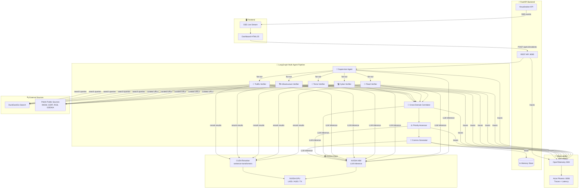
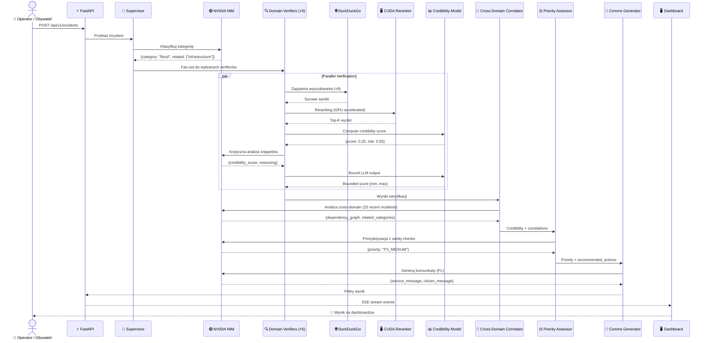
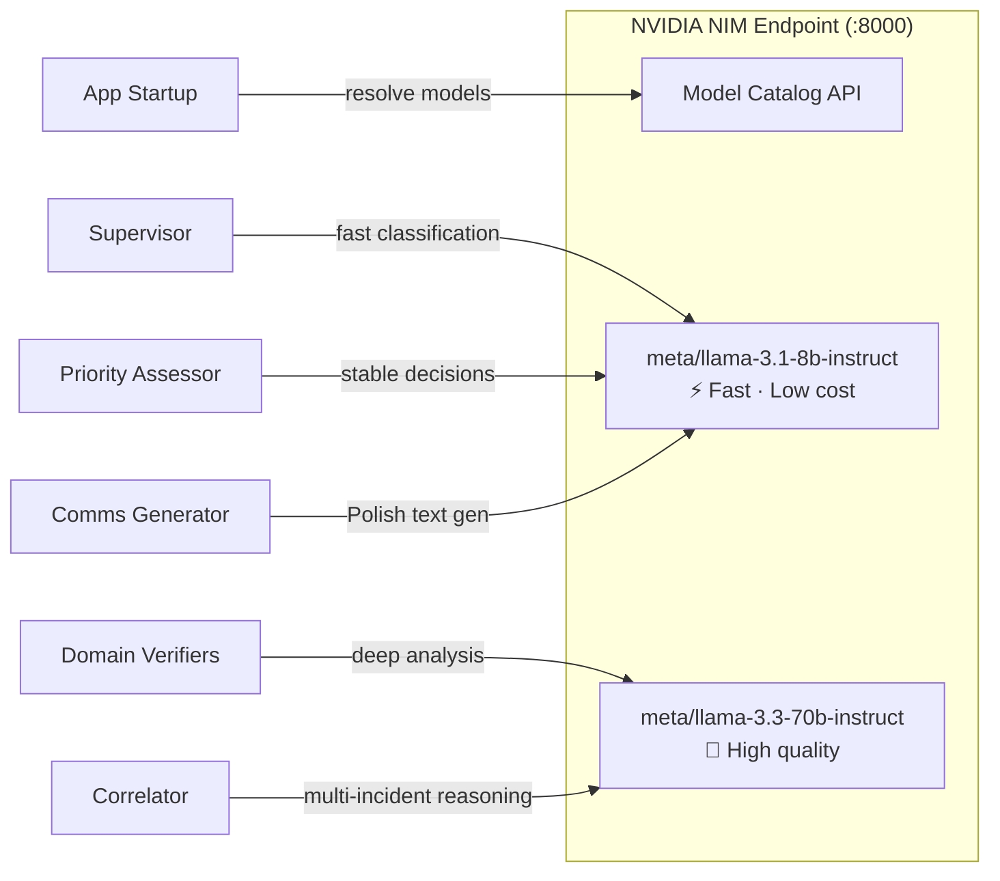
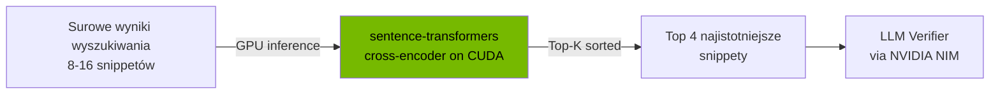
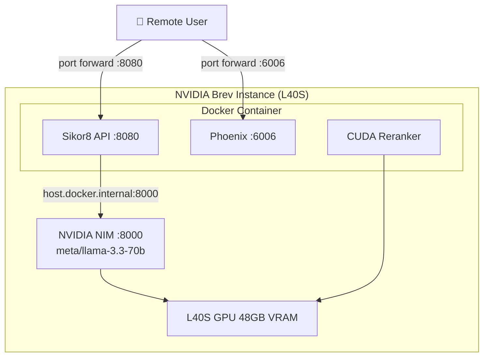
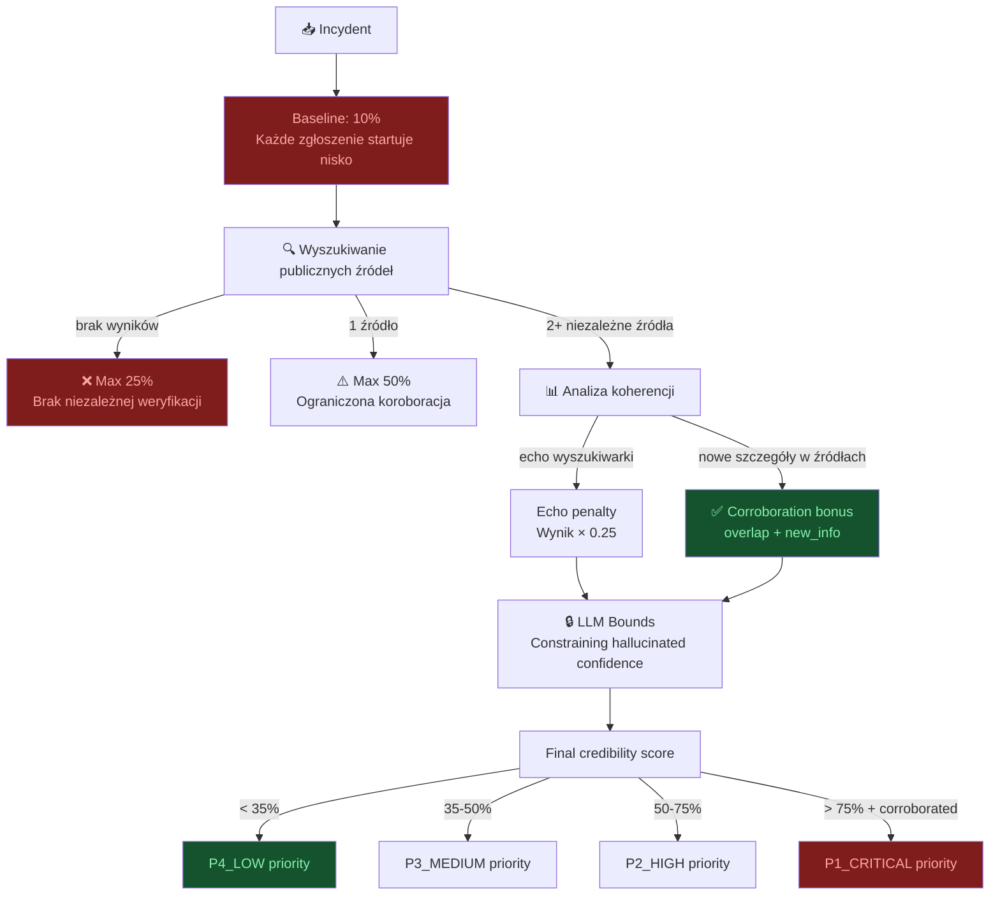

# 🛡️ Sikor8 — Crisis Management Center

> Wieloagentowy system AI wspierający centrum zarządzania kryzysowego.
> Zbudowany na **NVIDIA NIM + LangGraph + FastAPI** z pełną obserwowalnością i sceptycznym modelem weryfikacji wiarygodności.

---

## 📐 Architektura systemu



---

## 🔄 Przepływ przetwarzania incydentu



---

## 🟢 NVIDIA Technology Stack

### NVIDIA NIM (Neural Inference Microservice)

| Komponent | Rola | Szczegóły |
|---|---|---|
| **NVIDIA NIM** | Inferencja LLM | Lokalna lub chmurowa inferencja modeli Meta Llama |
| **Per-agent routing** | Optymalizacja | Każdy agent może korzystać z innego modelu NIM |
| **Automatic fallback** | Resilience | Przy 404 model_not_found → automatyczny retry z katalogiem NIM |
| **Model catalog** | Discovery | `GET /v1/models` — automatyczne mapowanie dostępnych modeli |



### NVIDIA CUDA — GPU-Accelerated Reranking

Moduł `app/agents/cuda_utils.py` implementuje **CUDA-accelerated semantic reranking**:



- **Model**: `cross-encoder/ms-marco-MiniLM-L-6-v2` na GPU
- **Zadanie**: Reranking wyników DuckDuckGo wg relevancji do opisu incydentu
- **Hardware**: Wykrywa CUDA automatycznie, fallback na CPU
- **Wpływ**: Eliminuje szum z wyników wyszukiwania zanim trafią do LLM

### NVIDIA GPU Requirements

| Profil | GPU | VRAM | Rekomendacja |
|---|---|---|---|
| **Minimum** | T4 | 16 GB | Tylko 8B modele |
| **Rekomendowany** | L40S | 48 GB | 8B + 70B mixed routing |
| **Optymalny** | A100 | 80 GB | Pełny 70B dla wszystkich agentów |

### Integracja z NVIDIA Brev



---

## 📊 Sceptyczny model weryfikacji wiarygodności

System implementuje philosophy **"START SKEPTICAL — EARN TRUST"**:



### Kluczowe mechanizmy anty-zawyżania

| Mechanizm | Opis |
|---|---|
| **Low baseline (10%)** | Niezweryfikowane zgłoszenie startuje na minimum |
| **Echo detection** | Wyniki wyszukiwania powtarzające query ≠ niezależna weryfikacja |
| **New info requirement** | True corroboration wymaga NOWYCH szczegółów w źródłach |
| **Evidence caps** | 0 wyników → max 25%, 1 wynik → max 50% |
| **LLM bounds** | Output LLM ograniczony do [min, max] wg ilości evidence |
| **Deepfake risk** | Startuje wysoko (55%), spada tylko z corroboration |
| **Priority sanity check** | Niska wiarygodność + wysoki deepfake risk → max P3 |

---

## 🛠️ Wykorzystywane technologie

### NVIDIA Ecosystem

| Technologia | Zastosowanie |
|---|---|
| **NVIDIA NIM** | Inferencja LLM (Llama 3.1/3.3) — lokalna lub cloud |
| **NVIDIA CUDA** | GPU-accelerated semantic reranking |
| **NVIDIA Brev** | Hosting instancji z GPU (L40S) |
| **NVIDIA Container Toolkit** | Docker + GPU passthrough |
| **langchain-nvidia-ai-endpoints** | Python SDK do NIM API |

### AI / ML Stack

| Technologia | Zastosowanie |
|---|---|
| **LangGraph** | Orchestracja multi-agent workflow z fan-out/fan-in |
| **LangChain** | Abstrakcja LLM calls + tool integration |
| **sentence-transformers** | Cross-encoder reranking na GPU |
| **PyTorch (CUDA)** | Runtime dla modeli reranking |

### Application Stack

| Technologia | Zastosowanie |
|---|---|
| **FastAPI** | REST API + SSE streaming + OpenAPI docs |
| **Pydantic v2** | Walidacja schematów, typed contracts |
| **DuckDuckGo Search** | Open-source OSINT (zero API keys) |
| **Arize Phoenix** | Observability — traces, latency, token usage |
| **OpenTelemetry** | Distributed tracing SDK |

### Infrastructure

| Technologia | Zastosowanie |
|---|---|
| **Docker** | Konteneryzacja z NVIDIA runtime |
| **Docker Compose** | Orchestracja usług |
| **CUDA 12.4 + cuDNN** | Base image (`nvidia/cuda:12.4.1-cudnn-runtime`) |

---

## 🏗️ Modele per agent (NVIDIA NIM)

Aplikacja pozwala przypisać osobny model NIM do każdego agenta:

| Agent | Rekomendowany model | Uzasadnienie |
|---|---|---|
| `supervisor` | `meta/llama-3.1-8b-instruct` | Szybka klasyfikacja, niski koszt |
| `domain_verifier` | `meta/llama-3.3-70b-instruct` | Najlepsza jakość analizy OSINT |
| `cross_domain_correlator` | `meta/llama-3.1-70b-instruct` | Wnioskowanie relacyjne multi-incident |
| `priority_assessor` | `meta/llama-3.1-8b-instruct` | Stabilne decyzje z sanity checks |
| `comms_generator` | `meta/llama-3.1-8b-instruct` | Szybkie generowanie komunikatów PL |

```dotenv
# .env
NVIDIA_BASE_URL=http://localhost:8000/v1
NVIDIA_API_KEY=no-key
NVIDIA_MODEL=meta/llama-3.3-70b-instruct

NVIDIA_MODEL_SUPERVISOR=meta/llama-3.1-8b-instruct
NVIDIA_MODEL_DOMAIN_VERIFIER=meta/llama-3.3-70b-instruct
NVIDIA_MODEL_CROSS_DOMAIN_CORRELATOR=meta/llama-3.1-70b-instruct
NVIDIA_MODEL_PRIORITY_ASSESSOR=meta/llama-3.1-8b-instruct
NVIDIA_MODEL_COMMS_GENERATOR=meta/llama-3.1-8b-instruct
```

---

## 🌐 Publiczne źródła danych (Polska)

| Domena | Źródła |
|---|---|
| 🌊 Flood | IMGW, RCB, Hydroportal, X (#powódź) |
| 💻 Cyber | CERT Polska, CSIRT GOV, NASK, Zaufana Trzecia Strona |
| 🚨 Terror | RCB, ABW, Policja, komunikaty państwowe |
| 🏗️ Infrastructure | GDDKiA, PKP PLK, PSE, dane.gov.pl |
| 🚗 Traffic | GDDKiA mapa dróg, API UM Warszawa, Jakdojade |

---

## 🔗 Endpointy API

### Incidents
| Method | Endpoint | Opis |
|---|---|---|
| `POST` | `/api/v1/incidents` | Przyjęcie zgłoszenia |
| `GET` | `/api/v1/incidents` | Lista zgłoszeń |
| `GET` | `/api/v1/incidents/{id}/result` | Wynik analizy |
| `GET` | `/api/v1/metrics/live` | Metryki realtime |
| `POST` | `/api/v1/incidents/{id}/approve` | Approval gate |
| `GET` | `/api/v1/incidents/{id}/approvals` | Historia zatwierdzeń |

### Visualization
| Method | Endpoint | Opis |
|---|---|---|
| `GET` | `/viz/stream/{id}` | SSE live stream agentów |
| `GET` | `/viz/graph` | Topologia Mermaid |
| `GET` | `/viz/graph/json` | Topologia JSON |

### System
| Method | Endpoint | Opis |
|---|---|---|
| `GET` | `/health` | Status + GPU info + tracing URL |

---

## 🚀 Uruchomienie

### Lokalne

```bash
pip install torch --index-url https://download.pytorch.org/whl/cu124
pip install -r requirements.txt
python main.py
```

### Docker

```bash
cp .env.example .env
# edytuj .env (ustaw NVIDIA_BASE_URL)
docker compose up --build
```

### NVIDIA Brev (L40S)

```bash
git clone <repo>
cd NvidiaHackathon2k26
cp .env.example .env
# Upewnij się że NIM odpowiada: curl http://localhost:8000/v1/models
docker build -t czk-api:latest .
docker run --gpus all --network host --env-file .env czk-api:latest
```

Po starcie:
- 🖥️ Dashboard: `http://localhost:8080/static/dashboard.html`
- 📄 API Docs: `http://localhost:8080/docs`
- 🔭 Phoenix Traces: `http://localhost:6006`

---

## 📁 Struktura projektu

```text
main.py                          # FastAPI entrypoint
requirements.txt                 # Dependencies (NVIDIA, LangGraph, CUDA)
Dockerfile                       # nvidia/cuda:12.4.1-cudnn base image
docker-compose.yml               # GPU container orchestration
langgraph.json                   # LangGraph Studio config
.env.example                     # Konfiguracja NVIDIA NIM + app

app/
  config.py                      # Pydantic settings (NVIDIA NIM config)
  store.py                       # In-memory incident store
  observability.py               # Arize Phoenix + OpenTelemetry setup
  schemas.py                     # Pydantic API contracts
  agents/
    graph.py                     # LangGraph workflow (9 nodes, fan-out)
    state.py                     # TypedDict state schema
    tools.py                     # DuckDuckGo search tool
    cuda_utils.py                # CUDA reranker (sentence-transformers)
    credibility_model.py         # Skeptical credibility scoring engine
    severity_engine.py           # Deterministic severity scoring
  api/
    incidents.py                 # Incident CRUD + metrics
    visualization.py             # SSE streaming + graph topology
  data/
    public_sources.py            # Polish OSINT source catalog
  security/
    prompt_guard.py              # LLM guardrails (regex + llm-guard)

static/
  dashboard.html                 # Real-time operator dashboard
  images/                        # Credibility visualization assets

examples/
  send_incidents.py              # Batch incident sender
  incidents/                     # 50 realistic crisis scenarios (5 categories × 10)
```

---

## 🧪 Testowanie

```bash
# Unit test modelu credibility
python test_credibility_model.py

# Wyślij 50 przykładowych incydentów
python examples/send_incidents.py

# Smoke test
curl http://localhost:8080/health
curl http://localhost:8080/viz/graph/json
```

Szczegółowe instrukcje: [examples/README.md](examples/README.md)

