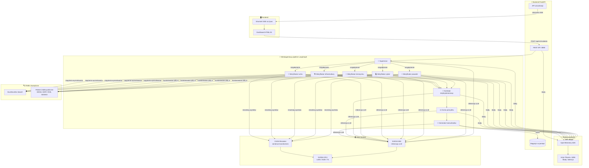
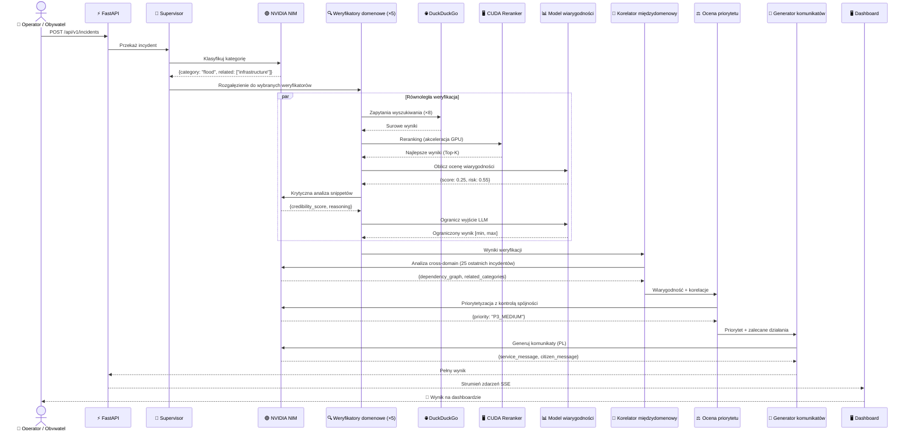
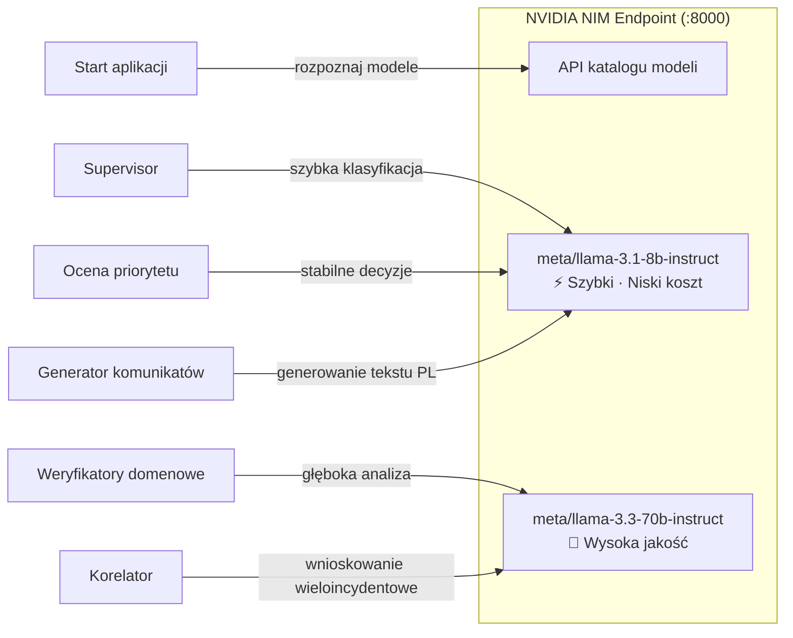
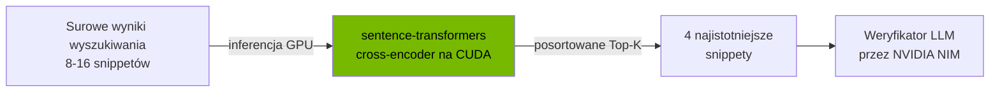
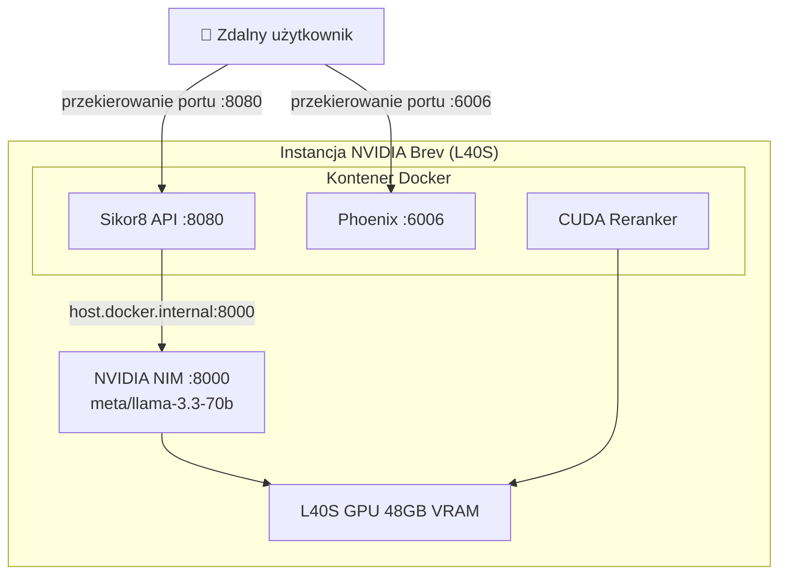
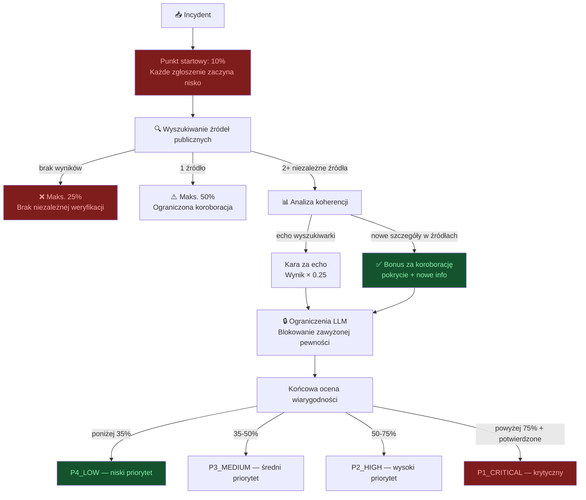

# 🛡️ Sikor8 — Crisis Management Center

> Wieloagentowy system AI wspierający centrum zarządzania kryzysowego.
> Zbudowany na **NVIDIA NIM + LangGraph + FastAPI** z pełną obserwowalnością i sceptycznym modelem weryfikacji wiarygodności.

---

## 📐 Architektura systemu



---

## 🔄 Przepływ przetwarzania incydentu



---

## 🟢 Stos technologiczny NVIDIA

### NVIDIA NIM (Neural Inference Microservice)

| Komponent | Rola | Szczegóły |
|---|---|---|
| **NVIDIA NIM** | Inferencja LLM | Lokalna lub chmurowa inferencja modeli Meta Llama |
| **Routing per agent** | Optymalizacja | Każdy agent może korzystać z innego modelu NIM |
| **Automatyczny fallback** | Odporność | Przy 404 model_not_found → automatyczny retry z katalogiem NIM |
| **Katalog modeli** | Odkrywanie | `GET /v1/models` — automatyczne mapowanie dostępnych modeli |



### NVIDIA CUDA — Reranking z akceleracją GPU

Moduł `app/agents/cuda_utils.py` implementuje **semantyczny reranking z akceleracją CUDA**:



- **Model**: `cross-encoder/ms-marco-MiniLM-L-6-v2` na GPU
- **Zadanie**: Reranking wyników DuckDuckGo wg trafności do opisu incydentu
- **Sprzęt**: Automatyczne wykrywanie CUDA, fallback na CPU
- **Wpływ**: Eliminuje szum z wyników wyszukiwania zanim trafią do LLM

### Wymagania GPU NVIDIA

| Profil | GPU | VRAM | Rekomendacja |
|---|---|---|---|
| **Minimum** | T4 | 16 GB | Tylko modele 8B |
| **Rekomendowany** | L40S | 48 GB | Mieszany routing 8B + 70B |
| **Optymalny** | A100 | 80 GB | Pełny 70B dla wszystkich agentów |

### Integracja z NVIDIA Brev



---

## 📊 Sceptyczny model weryfikacji wiarygodności

System implementuje filozofię **„ZACZNIJ SCEPTYCZNIE — ZAUFANIE TRZEBA ZDOBYĆ"**:



### Kluczowe mechanizmy anty-zawyżania

| Mechanizm | Opis |
|---|---|
| **Niski punkt startowy (10%)** | Niezweryfikowane zgłoszenie zaczyna na minimum |
| **Wykrywanie echa** | Wyniki powtarzające zapytanie ≠ niezależna weryfikacja |
| **Wymóg nowych informacji** | Prawdziwa koroboracja wymaga NOWYCH szczegółów w źródłach |
| **Limity wg dowodów** | 0 wyników → maks. 25%, 1 wynik → maks. 50% |
| **Ograniczenia wyjścia LLM** | Wynik LLM ograniczony do [min, max] wg ilości dowodów |
| **Ryzyko deepfake** | Startuje wysoko (55%), spada tylko przy koroboracji |
| **Kontrola spójności priorytetu** | Niska wiarygodność + wysokie ryzyko deepfake → maks. P3 |

---

## 🛠️ Wykorzystywane technologie

### Ekosystem NVIDIA

| Technologia | Zastosowanie |
|---|---|
| **NVIDIA NIM** | Inferencja LLM (Llama 3.1/3.3) — lokalna lub chmurowa |
| **NVIDIA CUDA** | Semantyczny reranking z akceleracją GPU |
| **NVIDIA Brev** | Hosting instancji z GPU (L40S) |
| **NVIDIA Container Toolkit** | Docker z obsługą GPU |
| **langchain-nvidia-ai-endpoints** | Python SDK do NVIDIA NIM API |

### Stos AI / ML

| Technologia | Zastosowanie |
|---|---|
| **LangGraph** | Orkiestracja wieloagentowa z rozgałęzieniem i złączaniem |
| **LangChain** | Abstrakcja wywołań LLM + integracja narzędzi |
| **sentence-transformers** | Reranking cross-encoder na GPU |
| **PyTorch (CUDA)** | Środowisko uruchomieniowe modeli reranking |

### Stos aplikacyjny

| Technologia | Zastosowanie |
|---|---|
| **FastAPI** | REST API + strumieniowanie SSE + dokumentacja OpenAPI |
| **Pydantic v2** | Walidacja schematów, typowane kontrakty |
| **DuckDuckGo Search** | OSINT open-source (zero kluczy API) |
| **Arize Phoenix** | Obserwowalność — ślady, latencja, zużycie tokenów |
| **OpenTelemetry** | SDK rozproszonego śledzenia |

### Infrastruktura

| Technologia | Zastosowanie |
|---|---|
| **Docker** | Konteneryzacja z NVIDIA runtime |
| **Docker Compose** | Orkiestracja usług |
| **CUDA 12.4 + cuDNN** | Obraz bazowy (`nvidia/cuda:12.4.1-cudnn-runtime`) |

---

## 🏗️ Modele per agent (NVIDIA NIM)

Aplikacja pozwala przypisać osobny model NIM do każdego agenta:

| Agent | Rekomendowany model | Uzasadnienie |
|---|---|---|
| `supervisor` | `meta/llama-3.1-8b-instruct` | Szybka klasyfikacja, niski koszt |
| `domain_verifier` | `meta/llama-3.3-70b-instruct` | Najlepsza jakość analizy OSINT |
| `cross_domain_correlator` | `meta/llama-3.1-70b-instruct` | Wnioskowanie relacyjne między incydentami |
| `priority_assessor` | `meta/llama-3.1-8b-instruct` | Stabilne decyzje z kontrolą spójności |
| `comms_generator` | `meta/llama-3.1-8b-instruct` | Szybkie generowanie komunikatów po polsku |

```dotenv
# .env
NVIDIA_BASE_URL=http://localhost:8000/v1
NVIDIA_API_KEY=no-key
NVIDIA_MODEL=meta/llama-3.3-70b-instruct

NVIDIA_MODEL_SUPERVISOR=meta/llama-3.1-8b-instruct
NVIDIA_MODEL_DOMAIN_VERIFIER=meta/llama-3.3-70b-instruct
NVIDIA_MODEL_CROSS_DOMAIN_CORRELATOR=meta/llama-3.1-70b-instruct
NVIDIA_MODEL_PRIORITY_ASSESSOR=meta/llama-3.1-8b-instruct
NVIDIA_MODEL_COMMS_GENERATOR=meta/llama-3.1-8b-instruct
```

---

## 🌐 Publiczne źródła danych (Polska)

| Domena | Źródła |
|---|---|
| 🌊 Powodzie | IMGW, RCB, Hydroportal, X (#powódź) |
| 💻 Cyberbezpieczeństwo | CERT Polska, CSIRT GOV, NASK, Zaufana Trzecia Strona |
| 🚨 Terroryzm | RCB, ABW, Policja, komunikaty państwowe |
| 🏗️ Infrastruktura | GDDKiA, PKP PLK, PSE, dane.gov.pl |
| 🚗 Ruch drogowy | GDDKiA mapa dróg, API UM Warszawa, Jakdojade |

---

## 🔗 Endpointy API

### Incydenty
| Metoda | Endpoint | Opis |
|---|---|---|
| `POST` | `/api/v1/incidents` | Przyjęcie zgłoszenia |
| `GET` | `/api/v1/incidents` | Lista zgłoszeń |
| `GET` | `/api/v1/incidents/{id}/result` | Wynik analizy |
| `GET` | `/api/v1/metrics/live` | Metryki w czasie rzeczywistym |
| `POST` | `/api/v1/incidents/{id}/approve` | Brama zatwierdzenia |
| `GET` | `/api/v1/incidents/{id}/approvals` | Historia zatwierdzeń |

### Wizualizacja
| Metoda | Endpoint | Opis |
|---|---|---|
| `GET` | `/viz/stream/{id}` | Strumień SSE agentów na żywo |
| `GET` | `/viz/graph` | Topologia Mermaid |
| `GET` | `/viz/graph/json` | Topologia JSON |

### System
| Metoda | Endpoint | Opis |
|---|---|---|
| `GET` | `/health` | Status + informacje o GPU + URL śledzenia |

---

## 🚀 Uruchomienie

### Lokalnie

```bash
pip install torch --index-url https://download.pytorch.org/whl/cu124
pip install -r requirements.txt
python main.py
```

### Docker

```bash
cp .env.example .env
# edytuj .env (ustaw NVIDIA_BASE_URL)
docker compose up --build
```

### NVIDIA Brev (L40S)

```bash
git clone <repo>
cd NvidiaHackathon2k26
cp .env.example .env
# Upewnij się że NIM odpowiada: curl http://localhost:8000/v1/models
docker build -t czk-api:latest .
docker run --gpus all --network host --env-file .env czk-api:latest
```

Po starcie:
- 🖥️ Dashboard: `http://localhost:8080/static/dashboard.html`
- 📄 Dokumentacja API: `http://localhost:8080/docs`
- 🔭 Ślady Phoenix: `http://localhost:6006`

---

## 📁 Struktura projektu

```text
main.py                          # Punkt wejścia FastAPI
requirements.txt                 # Zależności (NVIDIA, LangGraph, CUDA)
Dockerfile                       # Obraz bazowy nvidia/cuda:12.4.1-cudnn
docker-compose.yml               # Orkiestracja kontenerów z GPU
langgraph.json                   # Konfiguracja LangGraph Studio
.env.example                     # Konfiguracja NVIDIA NIM + aplikacji

app/
  config.py                      # Ustawienia Pydantic (konfiguracja NVIDIA NIM)
  store.py                       # Magazyn incydentów w pamięci
  observability.py               # Konfiguracja Arize Phoenix + OpenTelemetry
  schemas.py                     # Kontrakty API Pydantic
  agents/
    graph.py                     # Przepływ LangGraph (9 węzłów, rozgałęzienie)
    state.py                     # Schemat stanu TypedDict
    tools.py                     # Narzędzie wyszukiwania DuckDuckGo
    cuda_utils.py                # CUDA reranker (sentence-transformers)
    credibility_model.py         # Sceptyczny silnik oceny wiarygodności
    severity_engine.py           # Deterministyczny scoring istotności
  api/
    incidents.py                 # CRUD incydentów + metryki
    visualization.py             # Strumieniowanie SSE + topologia grafu
  data/
    public_sources.py            # Katalog polskich źródeł OSINT
  security/
    prompt_guard.py              # Zabezpieczenia LLM (regex + llm-guard)

static/
  dashboard.html                 # Dashboard operatora w czasie rzeczywistym
  images/                        # Zasoby wizualizacji wiarygodności

examples/
  send_incidents.py              # Masowe wysyłanie incydentów
  incidents/                     # 50 realistycznych scenariuszy kryzysowych (5 kategorii × 10)
```

---

## 🧪 Testowanie

```bash
# Test jednostkowy modelu wiarygodności
python test_credibility_model.py

# Wyślij 50 przykładowych incydentów
python examples/send_incidents.py

# Szybki test poprawności
curl http://localhost:8080/health
curl http://localhost:8080/viz/graph/json
```

Szczegółowe instrukcje: [examples/README.md](examples/README.md)

